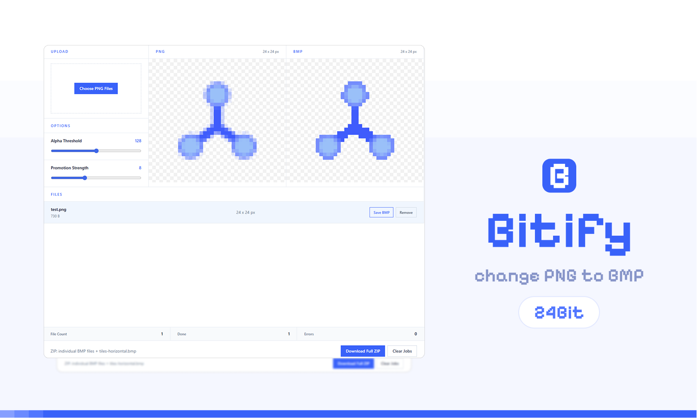

# Bitify

<p align="center">
  
</p>

Bitify is not a generic BMP converter. It is a reconstruction tool for tiny PNG assets that must survive in BMP pipelines where transparency is effectively binary and semi-transparent edge pixels cause blur, fringe, or broken borders.

A normal converter only changes the file container. Bitify rebuilds the image for restricted BMP consumers by analyzing antialiased PNG edges, recovering structure that would otherwise disappear, correcting edge colors, and exporting a BMP whose alpha is strictly `0` or `255`.

## Why It Exists

Small UI icons such as `24 x 24` assets often rely on semi-transparent edge pixels to make thin borders and diagonal strokes look smooth in PNG. That works in modern renderers, but many BMP-based or legacy consumers do not handle partial alpha correctly.

In those environments, a naive PNG-to-BMP conversion usually fails in one of these ways:

- soft edges turn into blur
- thin borders collapse or disappear
- antialias colors bleed into nearby pixels
- blue, gray, or shadow tones spread into transparent areas
- manually duplicated layers look better than automatic export

Bitify was built specifically to solve that class of problem.

## What Makes Bitify Different

- It targets binary-alpha output, not generic image conversion.
- It is tuned for very small icons where a single pixel changes the shape.
- It tries to preserve thin outlines and bridges instead of simply thresholding alpha.
- It repairs edge colors after binarization so surviving pixels do not inherit dirty fringe colors.
- It exports a BMP that is predictable for consumers that only tolerate fully off or fully on transparency.

## Technical Approach

Bitify runs a small reconstruction pipeline in the browser before encoding BMP output.

### 1. Smart alpha seeding

The pipeline does not start from a hard `128` cutoff alone. It lowers the initial seed threshold based on the recovery strength so medium-alpha pixels can still participate when they are likely part of a real border or stroke.

### 2. Bridge-aware recovery

After seeding, Bitify looks for candidate pixels that connect two opaque regions across horizontal, vertical, or diagonal directions. This helps recover thin borders, corners, and diagonal links that a naive threshold would erase.

### 3. Edge color correction

Once the binary mask is decided, Bitify replaces unreliable edge colors by sampling nearby opaque source pixels. This reduces halo artifacts such as blue spill, gray fringe, and dark outlines caused by PNG antialiasing against transparency.

### 4. Binary-alpha BMP encoding

The final export uses a `32-bit BMP V5` layout with BGRA channels, but the alpha channel is clamped to binary values only: `0` or `255`. That makes the output suitable for workflows that break when intermediate alpha values are present.

## Features

- Batch PNG upload with drag and drop
- Live original vs processed preview
- Adjustable alpha threshold and recovery strength
- Individual BMP download
- ZIP export with individual BMP files and a horizontal tile sheet BMP
- Fully local processing in the browser

## When To Use It

Bitify is a good fit when:

- your source assets are tiny icons or pixel-adjacent UI graphics
- the target program mishandles semi-transparent BMP edges
- a normal BMP export looks softer than the source PNG
- thin borders or corners vanish during conversion

It is not meant to replace a general-purpose image converter for photos or large illustrations.

## Tech Stack

- React
- Vite
- Tailwind CSS
- TypeScript
- Canvas-based pixel processing

## Getting Started

```bash
npm install
npm run dev
```

Open the local Vite URL in your browser, add PNG files, tune the conversion sliders, and download the BMP results.

## Scripts

```bash
npm run dev
npm run build
npm run test
npm run preview
```

## License

ISC
